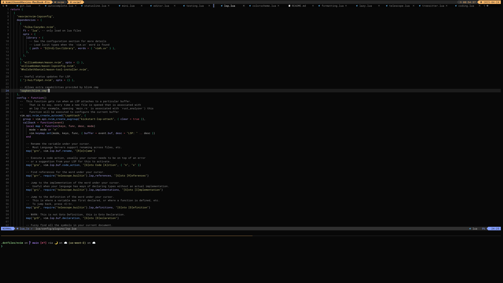
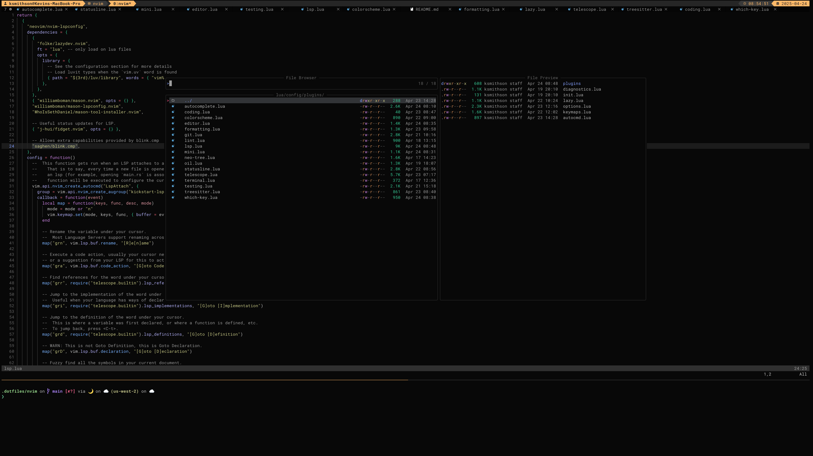
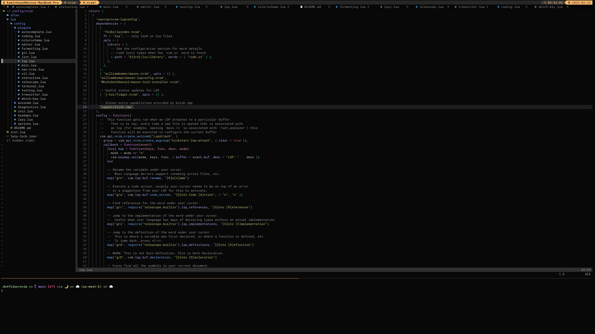
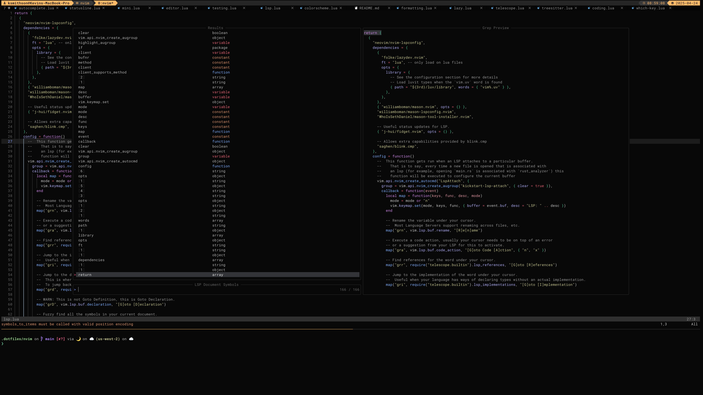
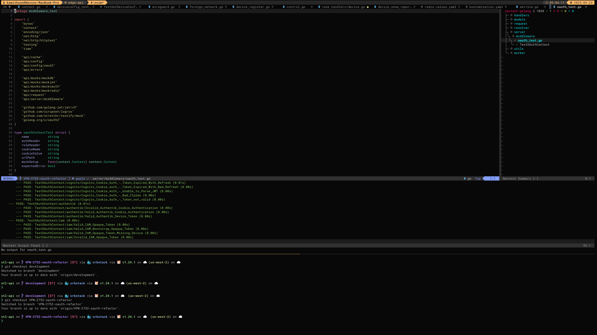

# NVIM Config

## External Tools

These are other tools that should be installed to help with some tools inside of neovim.

- [ripgrep](https://github.com/BurntSushi/ripgrep) - Speed up grepping inside telescope, also use `.rgignore` files

## Screenshots

